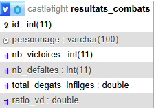
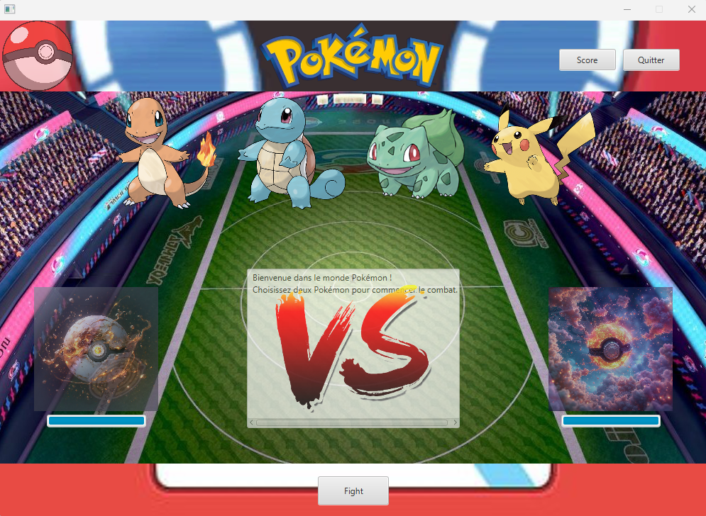
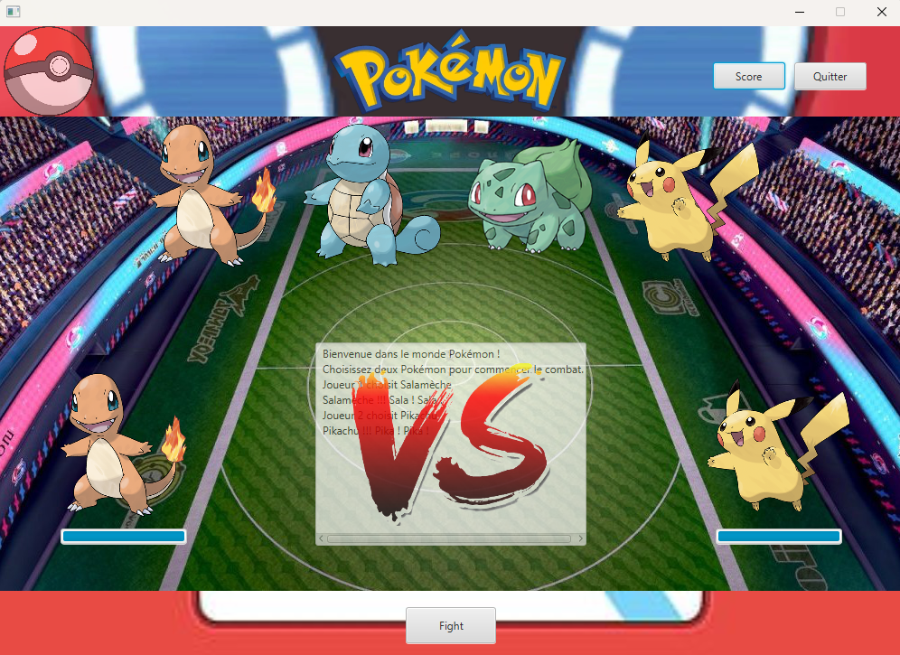
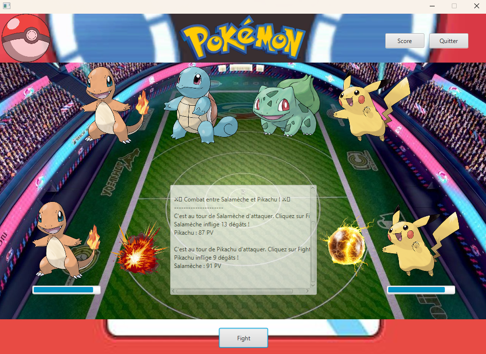
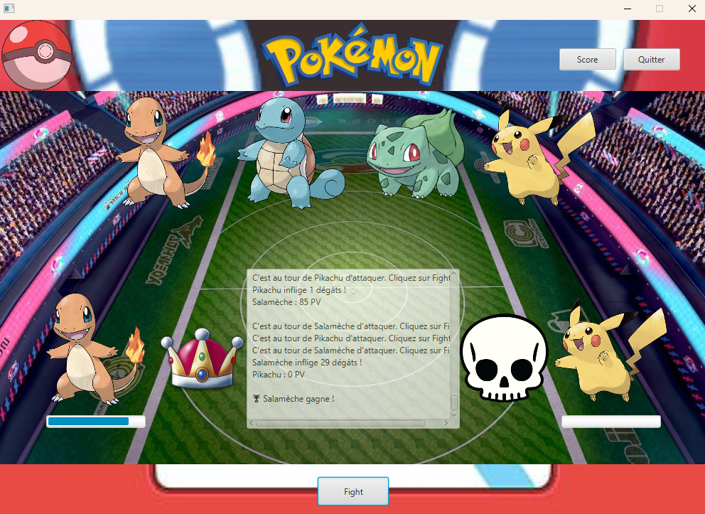
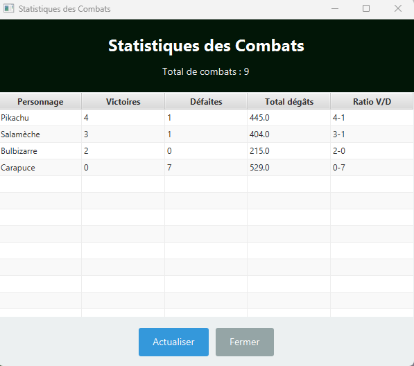

# CastleFight Graphique

Jeu d'affrontement Pokémon développé en JavaFX avec sauvegarde des statistiques de combats dans une base MySQL.

## Description

Cette application graphique permet à deux joueurs de choisir chacun un Pokémon et de lancer un combat en mode tour par tour. Chaque attaque inflige des dégâts aléatoires et le combat se termine lorsque l'un des Pokémon perd tous ses points de vie.

Une fenêtre de statistiques affiche les victoires, défaites et dégâts totaux infligés par chaque Pokémon.

## Fonctionnalités

### Combat Pokémon
- Choix de deux Pokémon parmi : Salamèche, Carapuce, Bulbizarre, Pikachu
- Combat tour par tour avec un seul bouton `Fight`
- Affichage des dégâts infligés et des points de vie restants
- Effets visuels simples pour les attaques
- Le premier attaquant est choisi aléatoirement

### Statistiques
- Enregistrement des résultats de combat dans une base MySQL
- Suivi des victoires et défaites par personnage
- Comptabilisation des dégâts totaux infligés
- Affichage des statistiques dans une table JavaFX

### Résilience
- Si la base de données n'est pas disponible, l'application démarre quand même
- Dans ce cas, les statistiques ne sont pas sauvegardées

## Prérequis

Avant d'installer et lancer l'application, installez :

- **Java 11**
- **Maven**
- **MySQL** (ou MariaDB)
- **JavaFX 13** (le projet utilise la dépendance Maven, donc aucun SDK JavaFX supplémentaire n'est requis si Maven télécharge les librairies)
- **XAMPP** ou un autre serveur MySQL local recommandé pour la base de données

## Installation

### 1. Cloner le dépôt

```bash
git clone https://github.com/Hugo-Demangeat/CasleFight_Graphique.git
cd CasleFight_Graphique
```

### 2. Importer la base de données MySQL

Ouvrez phpMyAdmin ou MySQL Workbench et importez le fichier `castlefight.sql` fourni.

Le projet utilise la base de données `castlefight` et la table `resultats_combats`.



## Guide d'utilisation

### 1. Lancer l'application

- Ouvrez le projet dans votre IDE (ex : NetBeans)
- Exécutez l’application JavaFX
- La fenêtre principale du jeu s’affiche



---

### 2. Sélection des Pokémon

- Choisissez un Pokémon pour le joueur 1
- Choisissez un Pokémon pour le joueur 2
- Pokémon disponibles :
  - Salamèche
  - Carapuce
  - Bulbizarre
  - Pikachu



---

### 3. Lancer un combat

- Cliquez sur le bouton `Fight`
- Le premier attaquant est choisi aléatoirement
- Le combat se déroule tour par tour
- Les dégâts et points de vie restants sont affichés



---

### 4. Suivre le combat

- Cliquez plusieurs fois sur `Fight` pour continuer le combat
- Les informations affichées :
  - Dégâts infligés
  - Points de vie restants
  - Résultat du combat



---

### 5. Consulter les statistiques

- Ouvrez la fenêtre des statistiques
- Consultez :
  - Victoires
  - Défaites
  - Dégâts totaux infligés
- Données enregistrées dans MySQL



---

### 6. Fonctionnement sans base de données

- L'application fonctionne même sans MySQL
- Les combats restent jouables
- Les statistiques ne sont pas sauvegardées

## Structure du projet

```
src/
├── main/
│   ├── java/
│   │   └── com/btssio66/hdemangeat/caslefight_graphique/
│   │       ├── App.java
│   │       ├── controller/
│   │       │   ├── PrimaryController.java
│   │       │   └── ScoresController.java
│   │       └── model/
│   │           ├── Bulbizarre.java
│   │           ├── Carapuce.java
│   │           ├── CombatDAO.java
│   │           ├── DatabaseConnection.java
│   │           ├── Personnage.java
│   │           ├── Pikachu.java
│   │           ├── Salamèche.java
│   │           └── StatistiquePersonnage.java
│   └── resources/
│       ├── com/btssio66/hdemangeat/caslefight_graphique/
│       │   ├── primary.fxml
│   │       │   └── scores.fxml
│       ├── css/
│       └── images/
```

## Technologies utilisées

- **Java 11**
- **JavaFX 13**
- **Maven**
- **MySQL / MariaDB**
- **FXML** pour l'interface graphique

## Auteur

Hugo Demangeat
